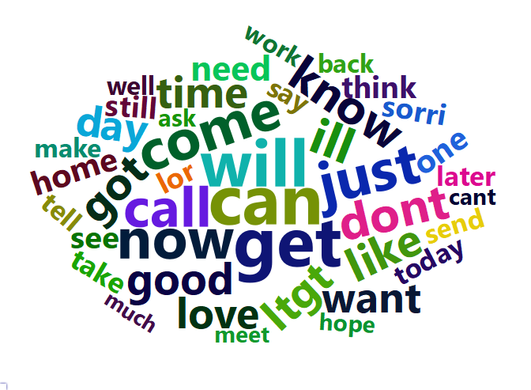

NLP: Spam data
================
Li-Hsin Chien
2024-03-23

# 1 下載資料

資料來源網址:
<https://archive.ics.uci.edu/dataset/228/sms+spam+collection>

R 程式碼來源: <https://rpubs.com/Seun/455974>

``` r
url <- "https://archive.ics.uci.edu/ml/machine-learning-databases/00228/smsspamcollection.zip"

if (!file.exists("smsspamcollection.zip")) 
{
  download.file(url=url, destfile="smsspamcollection.zip", method="curl")
}
unzip("smsspamcollection.zip")

data_text <- read.delim("SMSSpamCollection", sep="\t", header=F, colClasses="character", quote="")

# rename the column names
colnames(data_text) <- c("Class", "Text")

str(data_text) #5574 obs, 2 variables
```

    ## 'data.frame':    5574 obs. of  2 variables:
    ##  $ Class: chr  "ham" "ham" "spam" "ham" ...
    ##  $ Text : chr  "Go until jurong point, crazy.. Available only in bugis n great world la e buffet... Cine there got amore wat..." "Ok lar... Joking wif u oni..." "Free entry in 2 a wkly comp to win FA Cup final tkts 21st May 2005. Text FA to 87121 to receive entry question("| __truncated__ "U dun say so early hor... U c already then say..." ...

共 5574 個簡訊(樣本)，2 個變數。

``` r
table(data_text[,1])
```

    ## 
    ##  ham spam 
    ## 4827  747

5574 簡訊中，有 747 個垃圾簡訊(spam)，4827 個非垃圾簡訊(ham)。

第一筆簡訊的內容如下:

``` r
data_text[1,2]
```

    ## [1] "Go until jurong point, crazy.. Available only in bugis n great world la e buffet... Cine there got amore wat..."

# 2 資料清理 (data cleaning)

``` r
#install.packages("tm")
#install.packages("SnowballC")
library(tm) #text mining package
#library(SnowballC)
```

定義語音庫(corpus)

``` r
corpus <- VCorpus(VectorSource(data_text$Text)) #tm; corpus(文集/語文庫)
as.character(corpus[[3]])
```

    ## [1] "Free entry in 2 a wkly comp to win FA Cup final tkts 21st May 2005. Text FA to 87121 to receive entry question(std txt rate)T&C's apply 08452810075over18's"

## 2.1 將字都改成小寫 (put the words in lowercase)

``` r
corpus = tm_map(corpus, content_transformer(tolower))
as.character(corpus[[3]])
```

    ## [1] "free entry in 2 a wkly comp to win fa cup final tkts 21st may 2005. text fa to 87121 to receive entry question(std txt rate)t&c's apply 08452810075over18's"

## 2.2 去除 0~9 (removeNumber)

``` r
corpus = tm_map(corpus, removeNumbers)
as.character(corpus[[3]])
```

    ## [1] "free entry in  a wkly comp to win fa cup final tkts st may . text fa to  to receive entry question(std txt rate)t&c's apply over's"

## 2.3 去除標點符號 (Remove punctuation)

removePunctuation:Remove punctuation marks from a text document.

``` r
corpus = tm_map(corpus, removePunctuation)
as.character(corpus[[3]])
```

    ## [1] "free entry in  a wkly comp to win fa cup final tkts st may  text fa to  to receive entry questionstd txt ratetcs apply overs"

## 2.4 去除 stop words

Stop words: a, an, and, are, as, at, be, but, by, for, if, in, into, is,
it, no, not, of, on, or, such, that, the, their, then, there, these,
they, this, to, was, will and with…

``` r
corpus = tm_map(corpus, removeWords, stopwords("english"))
as.character(corpus[[3]])
```

    ## [1] "free entry    wkly comp  win fa cup final tkts st may  text fa    receive entry questionstd txt ratetcs apply overs"

## 2.5 去除多餘空白

``` r
corpus = tm_map(corpus, stripWhitespace)
as.character(corpus[[3]])
```

    ## [1] "free entry wkly comp win fa cup final tkts st may text fa receive entry questionstd txt ratetcs apply overs"

# 3 製作文件矩陣 (term-document matrix)

文件矩陣（term-document matrix）:
用來表示各個單詞在整個語料庫中之於文件的重要性。這裡用 term
frequency，即 $x_{ij}$ 代表第 $j$ 個term 在第 $i$ 個簡訊裡出現的次數。

``` r
dtm = DocumentTermMatrix(corpus)
dtm
```

    ## <<DocumentTermMatrix (documents: 5574, terms: 8305)>>
    ## Non-/sparse entries: 44222/46247848
    ## Sparsity           : 100%
    ## Maximal term length: 40
    ## Weighting          : term frequency (tf)

語音庫(corpus)中共有 5574 個簡訊 (document,row)，總共有 11577 個單詞
(term, column)。

接下來去掉出現頻率低的單詞:

``` r
dtm = removeSparseTerms(dtm, 0.999)
dim(dtm)
```

    ## [1] 5574 1287

單詞量減少至 1287 個。

將 term-document matrix 轉為矩陣格式:

``` r
mat<-as.matrix(dtm)
dim(mat)
```

    ## [1] 5574 1287

``` r
mat[3,mat[3,]>0]
```

    ##   apply    comp     cup   entry   final    free     may receive    text     txt 
    ##       1       1       1       2       1       1       1       1       1       1 
    ##     win    wkly 
    ##       1       1

``` r
as.character(corpus[[3]])
```

    ## [1] "free entry wkly comp win fa cup final tkts st may text fa receive entry questionstd txt ratetcs apply overs"

# 4 用文字雲比較 spam/ham 的字頻

``` r
y<-data_text$Class

mat2<-apply(mat,2,function(x) ifelse(x>0,1,0))
mat2[3,mat2[3,]>0]
```

    ##   apply    comp     cup   entry   final    free     may receive    text     txt 
    ##       1       1       1       1       1       1       1       1       1       1 
    ##     win    wkly 
    ##       1       1

``` r
mat_spam<-mat2[y=="spam",]
mat_ham<-mat2[y=="ham",]

freq.spam<- sort(colSums(mat_spam), decreasing=TRUE)
freq.ham.tmp<- round(sort(colSums(mat_ham), decreasing=TRUE),digits=0)
freq.ham<-round(freq.ham.tmp*sum(freq.spam)/sum(freq.ham.tmp),digits=0)
head(freq.spam)
```

    ##   call    now   free    txt mobile  claim 
    ##    322    181    169    142    110    108

``` r
head(freq.ham)
```

    ##  can will  get just  now dont 
    ##  101   91   84   83   83   70

``` r
wf.spam<- data.frame(word=names(freq.spam), freq=freq.spam)
wf.ham<- data.frame(word=names(freq.ham), freq=freq.ham)

library("wordcloud2")
```

    ## Warning: 套件 'wordcloud2' 是用 R 版本 4.3.2 來建造的

``` r
wordcloud2(wf.spam[1:200,], 
           minSize = 0, size = .8)
```

<!-- -->

``` r
wordcloud2(wf.ham[1:200,], 
           minSize = 0, size = .5)
```

<!-- -->

``` r
barplot(wf.spam[1:200,2],ylim=c(0,350),main="spam")
```

<!-- -->

``` r
barplot(wf.ham[1:200,2],ylim=c(0,350),main="ham")
```

<!-- -->

``` r
head(data.frame(wf.spam,wf.ham))
```

    ##          word freq word.1 freq.1
    ## call     call  322    can    101
    ## now       now  181   will     91
    ## free     free  169    get     84
    ## txt       txt  142   just     83
    ## mobile mobile  110    now     83
    ## claim   claim  108   dont     70

``` r
head(data.frame(wf.spam,wf.ham),100)
```

    ##                    word freq    word.1 freq.1
    ## call               call  322       can    101
    ## now                 now  181      will     91
    ## free               free  169       get     84
    ## txt                 txt  142      just     83
    ## mobile           mobile  110       now     83
    ## claim             claim  108      dont     70
    ## text               text  105       ill     68
    ## stop               stop   96       got     66
    ## reply             reply   91      know     65
    ## prize             prize   84      call     64
    ## get                 get   82      like     63
    ## just               just   78      ltgt     63
    ## won                 won   73      come     63
    ## new                 new   68      good     62
    ## send               send   68       day     53
    ## urgent           urgent   62      time     53
    ## cash               cash   61      love     48
    ## win                 win   61     going     48
    ## contact         contact   56      want     47
    ## please           please   54      home     47
    ## service         service   54      need     45
    ## nokia             nokia   53       one     44
    ## guaranteed   guaranteed   50     still     43
    ## customer       customer   49     sorry     42
    ## box                 box   48       lor     42
    ## phone             phone   46       see     40
    ## per                 per   45     later     39
    ## ppm                 ppm   44     think     37
    ## week               week   42      well     37
    ## will               will   42      back     37
    ## tone               tone   41     today     37
    ## awarded         awarded   38      send     35
    ## chat               chat   38      tell     35
    ## draw               draw   38      cant     33
    ## mins               mins   38      take     33
    ## line               line   35      much     31
    ## latest           latest   34       hey     31
    ## every             every   33     night     30
    ## holiday         holiday   32      hope     29
    ## landline       landline   32       way     28
    ## shows             shows   31      work     28
    ## apply             apply   30     great     27
    ## number           number   30     thats     27
    ## pobox             pobox   30       wat     27
    ## camera           camera   29      give     27
    ## code               code   29   already     26
    ## message         message   29       pls     26
    ## receive         receive   29       say     26
    ## tcs                 tcs   29      dear     25
    ## can                 can   28      make     25
    ## chance           chance   27     happy     25
    ## want               want   27      yeah     25
    ## collection   collection   26     right     24
    ## msg                 msg   26       ask     24
    ## orange           orange   26    really     24
    ## video             video   26     didnt     23
    ## network         network   25     phone     23
    ## offer             offer   25      said     23
    ## ringtone       ringtone   25  tomorrow     23
    ## selected       selected   25   morning     22
    ## sms                 sms   25    please     22
    ## live               live   24       cos     22
    ## mob                 mob   24       lol     22
    ## weekly           weekly   24  anything     21
    ## cost               cost   23       yes     21
    ## find               find   23       ive     20
    ## valid             valid   23      meet     20
    ## attempt         attempt   22      pick     20
    ## back               back   22       let     20
    ## collect         collect   22      sure     20
    ## hrs                 hrs   22       amp     20
    ## word               word   22      babe     20
    ## bonus             bonus   21 something     20
    ## entry             entry   21      text     19
    ## know               know   21      also     19
    ## pmin               pmin   21      last     19
    ## sae                 sae   21      miss     19
    ## yes                 yes   21       new     19
    ## delivery       delivery   20      care     19
    ## gift               gift   20       gud     18
    ## help               help   20      life     18
    ## rate               rate   20    number     18
    ## todays           todays   20     thing     18
    ## tones             tones   20      week     18
    ## tscs               tscs   20      free     17
    ## vouchers       vouchers   20      keep     17
    ## account         account   19    thanks     17
    ## await             await   19    always     17
    ## award             award   19       buy     17
    ## dont               dont   19      sent     17
    ## music             music   19      feel     17
    ## see                 see   19     gonna     17
    ## time               time   19      nice     17
    ## land               land   18   tonight     17
    ## play               play   18      wait     17
    ## price             price   18    around     16
    ## private         private   18      soon     16
    ## unsubscribe unsubscribe   18      even     16
    ## colour           colour   17     place     16
    ## day                 day   17     first     16
