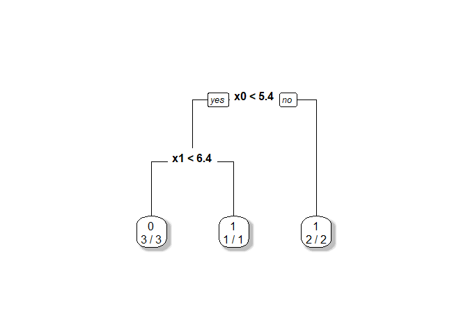
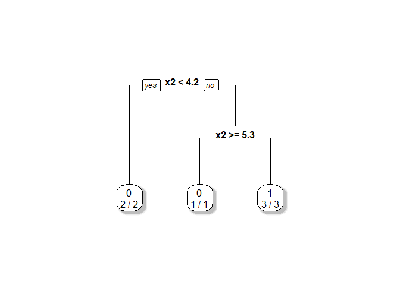
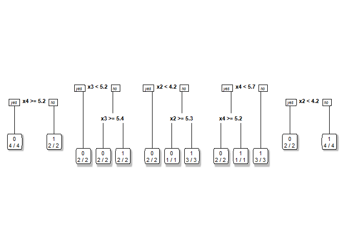
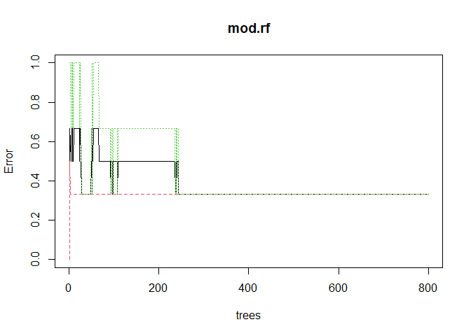

Decision tree & Random Forest
================
Li-Hsin Chien
2023-10-01

## Decision Tree

``` r
x0<-c(4.3,3.9,2.7,6.6,6.5,2.7)
x1<-c(4.9,6.1,4.8,4.4,2.9,6.7)
x2<-c(4.1,5.9,4.1,4.5,4.7,4.2)
x3<-c(4.7,5.5,5.0,3.9,4.6,5.3)
x4<-c(5.5,5.9,5.6,5.9,6.1,4.8)
y<-as.factor(c(0,0,0,1,1,1))
#y<-(c(0,0,0,1,1,1))
id<-1:6
(data<-data.frame(x0,x1,x2,x3,x4,y))
```

    ##    x0  x1  x2  x3  x4 y
    ## 1 4.3 4.9 4.1 4.7 5.5 0
    ## 2 3.9 6.1 5.9 5.5 5.9 0
    ## 3 2.7 4.8 4.1 5.0 5.6 0
    ## 4 6.6 4.4 4.5 3.9 5.9 1
    ## 5 6.5 2.9 4.7 4.6 6.1 1
    ## 6 2.7 6.7 4.2 5.3 4.8 1

``` r
library(rpart)

fit <- rpart(y~x0+x1+x2+x3+x4,minsplit=1)
```

``` r
library(rpart.plot)
```

    ## Warning: 套件 'rpart.plot' 是用 R 版本 4.3.1 來建造的

``` r
#require(rpart.plot) 
prp(fit,         # 模型
    faclen=0,           # 呈現的變數不要縮寫
    fallen.leaves=TRUE, # 讓樹枝以垂直方式呈現
    shadow.col="gray",  # 最下面的節點塗上陰影
    # number of correct classifications / number of observations in that node
    extra=2)  
```

<!-- -->

``` r
x0.2<-x0
x0.2[2]<-6.5
x1.2<-x1
x1.2[2]<-4.1

fit2 <- rpart(y~x0.2+x1.2+x2+x3+x4,minsplit=1)
prp(fit2,         # 模型
    faclen=0,           # 呈現的變數不要縮寫
    fallen.leaves=TRUE, # 讓樹枝以垂直方式呈現
    shadow.col="gray",  # 最下面的節點塗上陰影
    # number of correct classifications / number of observations in that node
    extra=2)  
```

<!-- -->

``` r
set.seed(1234)
set.seed(344)
id.boot1<-sample(id,6,replace=T)
id.boot2<-sample(id,6,replace=T)
id.boot3<-sample(id,6,replace=T)
id.boot4<-sample(id,6,replace=T)
id.boot5<-sample(id,6,replace=T)

var.s1<-sample(0:4,2)
var.s2<-sample(0:4,2)
var.s3<-sample(0:4,2)
var.s4<-sample(0:4,2)
var.s5<-sample(0:4,2)

cbind(id.boot1,id.boot2,id.boot3,id.boot4,id.boot5)
```

    ##      id.boot1 id.boot2 id.boot3 id.boot4 id.boot5
    ## [1,]        3        2        3        5        3
    ## [2,]        6        3        5        1        3
    ## [3,]        1        6        6        6        5
    ## [4,]        6        3        5        4        2
    ## [5,]        1        6        2        1        6
    ## [6,]        2        2        3        5        6

``` r
cbind(var.s1,var.s2,var.s3,var.s4,var.s5)
```

    ##      var.s1 var.s2 var.s3 var.s4 var.s5
    ## [1,]      2      0      0      4      0
    ## [2,]      1      1      2      1      4

``` r
fit.b1<- rpart(y~x3+x4,data=data[id.boot1,],minsplit=1)
fit.b2<- rpart(y~x3+x2,data=data[id.boot2,],minsplit=1)
fit.b3<- rpart(y~x2+x0,data=data[id.boot3,],minsplit=1)
fit.b4<- rpart(y~x4+x3,data=data[id.boot4,],minsplit=1)
fit.b5<- rpart(y~x2+x1,data=data[id.boot4,],minsplit=1)
```

``` r
par(mfrow=c(1,5))
prp(fit.b1,         # 模型
    faclen=0,           # 呈現的變數不要縮寫
    fallen.leaves=TRUE, # 讓樹枝以垂直方式呈現
    shadow.col="gray",  # 最下面的節點塗上陰影
    # number of correct classifications / number of observations in that node
    extra=2)  
prp(fit.b2,         # 模型
    faclen=0,           # 呈現的變數不要縮寫
    fallen.leaves=TRUE, # 讓樹枝以垂直方式呈現
    shadow.col="gray",  # 最下面的節點塗上陰影
    # number of correct classifications / number of observations in that node
    extra=2) 
prp(fit.b3,         # 模型
    faclen=0,           # 呈現的變數不要縮寫
    fallen.leaves=TRUE, # 讓樹枝以垂直方式呈現
    shadow.col="gray",  # 最下面的節點塗上陰影
    # number of correct classifications / number of observations in that node
    extra=2) 
prp(fit.b4,         # 模型
    faclen=0,           # 呈現的變數不要縮寫
    fallen.leaves=TRUE, # 讓樹枝以垂直方式呈現
    shadow.col="gray",  # 最下面的節點塗上陰影
    # number of correct classifications / number of observations in that node
    extra=2) 
prp(fit.b5,         # 模型
    faclen=0,           # 呈現的變數不要縮寫
    fallen.leaves=TRUE, # 讓樹枝以垂直方式呈現
    shadow.col="gray",  # 最下面的節點塗上陰影
    # number of correct classifications / number of observations in that node
    extra=2) 
```

<!-- -->

### Random Forest

``` r
#install.packages("randomForest")
library(randomForest)
```

    ## Warning: 套件 'randomForest' 是用 R 版本 4.3.1 來建造的

    ## randomForest 4.7-1.1

    ## Type rfNews() to see new features/changes/bug fixes.

``` r
mod.rf <-randomForest(y~.,data=data,ntree=800)
mod.rf
```

    ## 
    ## Call:
    ##  randomForest(formula = y ~ ., data = data, ntree = 800) 
    ##                Type of random forest: classification
    ##                      Number of trees: 800
    ## No. of variables tried at each split: 2
    ## 
    ##         OOB estimate of  error rate: 33.33%
    ## Confusion matrix:
    ##   0 1 class.error
    ## 0 2 1   0.3333333
    ## 1 1 2   0.3333333

``` r
plot(mod.rf)
```

<!-- -->

``` r
test.data<-data.frame(x0=c(2.8,2.7,6),x1=c(3,6.2,2),x2=c(2,4.3,6),x3=c(6,5.3,1),x4=c(3,5.5,5))
(r<-predict(mod.rf,test.data,type="prob"))
```

    ##         0       1
    ## 1 0.58625 0.41375
    ## 2 0.60125 0.39875
    ## 3 0.18250 0.81750
    ## attr(,"class")
    ## [1] "matrix" "array"  "votes"
