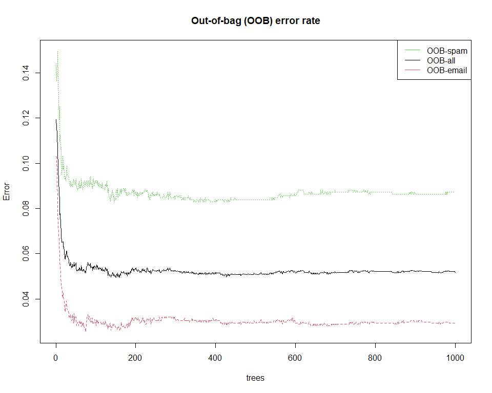

Tree-Based Methods_spam example
================
Li-Hsin Chien
2024-03-10

- [1 Spam Dataset](#1-spam-dataset)
  - [1.1 讀入資料](#11-讀入資料)
  - [1.2 資料分群](#12-資料分群)
- [2 決策樹分析 (Decision Tree: Classification
  Tree)](#2-決策樹分析-decision-tree-classification-tree)
  - [2.1 利用 Training set
    資料建立模型](#21-利用-training-set-資料建立模型)
  - [2.2 利用 Testing set
    資料驗證模型好壞](#22-利用-testing-set-資料驗證模型好壞)
- [3 隨機森林 (Random Forest)](#3-隨機森林-random-forest)
- [4 References](#4-references)

# 1 Spam Dataset

這筆資料收集 4601 封在某段時間寄給 HP (惠普公司) 的 e-mail
(observations,樣本數 4601), 每封 e-mail 被註記 (labelled) 為垃圾郵件
(spam)(1) 或非垃圾郵件 (0)。由郵件內容整理出 57 個變數/特徵值 (
covariates 解釋變數, features) 如下:

<!-- -->

資料可於下方網址下載，這份文件所用的程式碼也參考這個網站。

- <https://github.com/Robby955/spam/tree/main>

同學可先於上面網站中下載資料檔 (檔名: *spam.RData*)，以下用 R
軟體做資料分析。

## 1.1 讀入資料

``` r
load("spam.RData") # 讀入資料

colNames=c('make','address','all','3d','our','over','remove','internet','order','mail','recieve','will','people','report','addresses','free','business','email','you','credit','your','font','000','money','hp','hpl','george','650','lab','labs','telnet','857','data','415','85','technology','1999','parts','pm','direct','cs','meeting','original','project','re','edu','table','confrence',';','(','[','!','$','#','CAPAVE','CAPMAX','CAPTOT',"SPAM")

colnames(spam)=colNames #更改欄位名稱
```

## 1.2 資料分群

將資料切成三等份，分為兩群:

- Training set (訓練集): 用來建立模型，佔三等份中的兩等分
- Testing set (測試集): 用來測試模型好壞，佔三等份中的一等分

``` r
set.seed(123) #固定隨機seed
# Train Test Split
train_ind <- sample(seq_len(nrow(spam)), size = 0.66*nrow(spam))
spam_train <- spam[train_ind, ]
spam_test <- spam[-train_ind, ]

spam_train_pred=spam_train[,1:57] #train: covariates (x)
spam_train_ind=spam_train[,58]             #train: outcome (y)

spam_test_pred=spam_test[,1:57]   #test: covariates (x)
spam_test_ind=spam_test[,58]               #test: outcome (y)
```

# 2 決策樹分析 (Decision Tree: Classification Tree)

載入所需的 R 套件

``` r
#install.packages("rpart") #安裝套件
#install.packages("rpart.plot")

library(rpart)
library(rpart.plot)
library(caret)
#library(caTools)
```

## 2.1 利用 Training set 資料建立模型

``` r
modelTree=rpart(as.factor(spam_train_ind)~.,data=spam_train_pred,method='class',control = rpart.control(min_bucket=5,cp=0.005))
#summary(modelTree)
getPred.train=predict(modelTree,newdata=spam_train_pred)[,2]
getPred.train[getPred.train>0.5]=1
getPred.train[getPred.train<=0.5]=0

spam_train_ind2<-ifelse(spam_train_ind=="spam",1,0)
confusionMatrix(as.factor(spam_train_ind2),as.factor(getPred.train))
```

    ## Confusion Matrix and Statistics
    ## 
    ##           Reference
    ## Prediction    0    1
    ##          0 1752   92
    ##          1  138 1054
    ##                                           
    ##                Accuracy : 0.9242          
    ##                  95% CI : (0.9143, 0.9334)
    ##     No Information Rate : 0.6225          
    ##     P-Value [Acc > NIR] : < 2.2e-16       
    ##                                           
    ##                   Kappa : 0.8401          
    ##                                           
    ##  Mcnemar's Test P-Value : 0.003005        
    ##                                           
    ##             Sensitivity : 0.9270          
    ##             Specificity : 0.9197          
    ##          Pos Pred Value : 0.9501          
    ##          Neg Pred Value : 0.8842          
    ##              Prevalence : 0.6225          
    ##          Detection Rate : 0.5771          
    ##    Detection Prevalence : 0.6074          
    ##       Balanced Accuracy : 0.9234          
    ##                                           
    ##        'Positive' Class : 0               
    ## 

劃出分類樹(Classification Tree)

``` r
rpart.plot(modelTree, extra = 106, nn = TRUE)
```

<!-- -->

每個節點 (node) 內容的說明如下圖:


## 2.2 利用 Testing set 資料驗證模型好壞

``` r
getPred=predict(modelTree,newdata=spam_test_pred)[,2]
getPred[getPred>0.5]=1
getPred[getPred<=0.5]=0

spam_test_ind2<-ifelse(spam_test_ind=="spam",1,0)
confusionMatrix(as.factor(spam_test_ind2),as.factor(getPred))
```

    ## Confusion Matrix and Statistics
    ## 
    ##           Reference
    ## Prediction   0   1
    ##          0 885  59
    ##          1  72 549
    ##                                           
    ##                Accuracy : 0.9163          
    ##                  95% CI : (0.9015, 0.9295)
    ##     No Information Rate : 0.6115          
    ##     P-Value [Acc > NIR] : <2e-16          
    ##                                           
    ##                   Kappa : 0.8245          
    ##                                           
    ##  Mcnemar's Test P-Value : 0.2944          
    ##                                           
    ##             Sensitivity : 0.9248          
    ##             Specificity : 0.9030          
    ##          Pos Pred Value : 0.9375          
    ##          Neg Pred Value : 0.8841          
    ##              Prevalence : 0.6115          
    ##          Detection Rate : 0.5655          
    ##    Detection Prevalence : 0.6032          
    ##       Balanced Accuracy : 0.9139          
    ##                                           
    ##        'Positive' Class : 0               
    ## 

# 3 隨機森林 (Random Forest)

``` r
library(randomForest)
```

``` r
modelForest=randomForest(as.factor(spam_train_ind)~.,data=data.frame(spam_train_pred),type='classification',importance=TRUE,
                         ntree=1000)
plot(modelForest,main="Out-of-bag error rate")
legend("topright",c("OOB-spam","OOB-all","OOB-email"),col=c(3,1,2),lty=1)
```

<!-- -->

``` r
pforest=predict(modelForest,newdata=data.frame(spam_test_pred))
confusionMatrix(as.factor(spam_test_ind),pforest)
```

    ## Confusion Matrix and Statistics
    ## 
    ##           Reference
    ## Prediction email spam
    ##      email   911   33
    ##      spam     42  579
    ##                                           
    ##                Accuracy : 0.9521          
    ##                  95% CI : (0.9403, 0.9621)
    ##     No Information Rate : 0.6089          
    ##     P-Value [Acc > NIR] : <2e-16          
    ##                                           
    ##                   Kappa : 0.8996          
    ##                                           
    ##  Mcnemar's Test P-Value : 0.3556          
    ##                                           
    ##             Sensitivity : 0.9559          
    ##             Specificity : 0.9461          
    ##          Pos Pred Value : 0.9650          
    ##          Neg Pred Value : 0.9324          
    ##              Prevalence : 0.6089          
    ##          Detection Rate : 0.5821          
    ##    Detection Prevalence : 0.6032          
    ##       Balanced Accuracy : 0.9510          
    ##                                           
    ##        'Positive' Class : email           
    ## 

# 4 References

- <https://search.r-project.org/CRAN/refmans/kernlab/html/spam.html>
- <https://github.com/Robby955/spam/tree/main>
